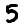
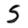
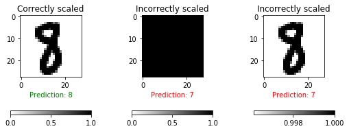
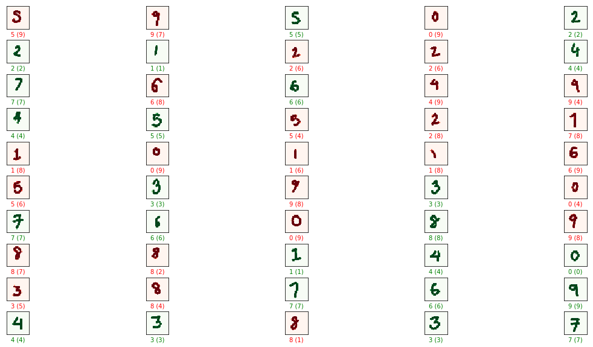
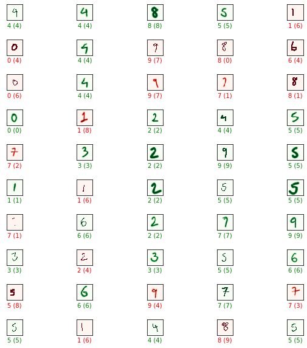

# mnist_demo
Demonstrating the use of ML for digit classification using the MNIST dataset.

This repo follows the excellent introduction to Deep Learning and Neural Networks given by Michael Nielsen at http://neuralnetworksanddeeplearning.com

Code in these notebooks are generally taken from that website, and had been modified for Python 3 compatibility and added functionality/experimentation.

Happy DL-ing with NNs! :)

### Note on datasets used
I started this notebook using only the MNIST digits dataset, but quickly started generating my own images to test out the network performance on digits it DEFNITELY had not seen before. Some samples below: 

#### Sample MNIST digits

#### Sample test digits - set 1

#### Sample test digits - set 2

### An example of the trained network output:

#### Actual Value (Predicted Value)

### An example of poor scaling causing bad classifications:

### A saved TF model results in less than 50% accuracy, when it's accuracy was ~98% on the MNIST set. The reason for this is being currently explored

### Update:
The reason for the poor performance on the custom generated dataset seems to be caused due to the way the digits are written. Some of it is offset by a newer set of 'better looking' digits (see below). I will be conducting further tests using CNNs to see how the performance changes.

### Current network performance: 

